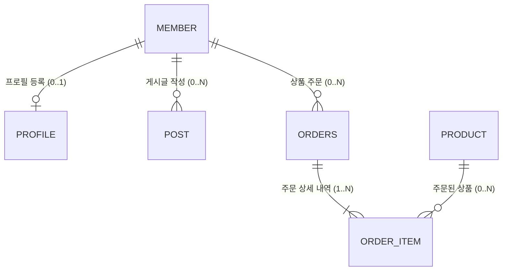

---
{"dg-publish":true,"permalink":"/01-dev-stack/04/01-sql/01-oracle/07-erd-editer/","dg-note-properties":{"작성일":"2026-01-07T22:40","수정일":"2025-12-30T13:19"}}
---

# ERD 관계와 데이터 제약 조건 가이드

> [!summary]
> 데이터베이스 설계 시 엔티티 간의 **수적 관계(Cardinality)**와 데이터의 **무결성 유지(On Delete)**를 위한 제약 조건을 정의한 노트입니다. 기호의 의미를 정확히 이해하고 상황에 맞는 삭제 정책을 수립하는 것이 핵심입니다.

## 1. ERD 카디널리티(Cardinality) 기호 및 의미

ERD에서 관계 선의 끝부분 기호는 데이터의 존재 여부와 개수를 의미합니다.

| 종류       | 기호 이름        | 핵심 의미  | 데이터 존재 여부  | 기호 표현  |
| -------- | ------------ | ------ | ---------- | ------ |
| **0..1** | **ZERO ONE** | 선택적 하나 | 없거나, 최대 1개 | `--o+` |
| **0..N** | **ZERO N**   | 선택적 다수 | 없거나, 많거나   | `--o<` |
| **1**    | **ONE ONLY** | 필수적 하나 | 무조건 1개만    | `--++` |
| **1..N** | **ONE N**    | 필수적 다수 | 최소 1개 ~ 다수 | `--+<` |

---

## 2. 관계별 상세 설명 및 사례

### 1) ZERO ONE (0..1) : "최대 하나"

* **설명:** 대상 데이터가 존재하지 않을 수도 있고, 존재한다면 반드시 하나만 존재해야 합니다.
* **사례:** **회원(USER) ↔ 프로필 자기소개(BIO)**
* 자기소개를 작성하지 않은 회원은 0개(Zero), 작성했다면 단 하나(One)의 프로필만 가집니다.

### 2) ZERO N (0..*) : "자유로운 관계"

* **설명:** 데이터가 없을 수도 있고, 여러 개가 존재할 수도 있는 가장 보편적인 관계입니다.
* **사례:** **회원(USER) ↔ 작성한 게시글(POST)**
* 신규 회원은 게시글이 0개일 수 있으며, 활동에 따라 수백 개의 글을 작성할 수 있습니다.

### 3) ONE ONLY (1) : "필수적 단일성"

* **설명:** 데이터가 반드시 존재해야 하며, 오직 하나만 존재해야 하는 엄격한 관계입니다.
* **사례:** **게시글(POST) ↔ 작성자(USER)**
* 모든 게시글은 반드시 주인(작성자)이 있어야 하며, 한 글의 주인이 동시에 여러 명일 수 없습니다.

### 4) ONE N (1..*) : "최소 하나 이상의 존재"

* **설명:** 최소 한 개의 데이터는 보장되어야 하며, 그 이상도 가능합니다.
* **사례:** **쇼핑몰 주문(ORDER) ↔ 주문 상품(ORDER_ITEM)**
* 상품이 담기지 않은 주문은 성립될 수 없으므로, 주문 데이터 생성 시 최소 1개 이상의 상품 정보가 필요합니다.

---

## 3. 삭제 정책 (ON DELETE) 및 제약 조건

엔티티 간의 결합 강도에 따라 부모 데이터 삭제 시 자식 데이터를 어떻게 처리할지 결정해야 합니다.

| ERD 관계                   | 관계 성격      | 권장 삭제 정책 (ON DELETE)    | 예시             |
| ------------------------ | ---------- | ----------------------- | -------------- |
| **1 : 1 (MANDATORY)**    | **강한 결합**  | `CASCADE` (동반 삭제)       | 계정 ↔ 개인정보      |
| **1 : N (MANDATORY)**    | **강한 결합**  | `CASCADE` (동반 삭제)       | 게시글 ↔ 첨부파일     |
| **0 : N (OPTIONAL)**     | **약한 결합**  | `SET NULL` / `RESTRICT` | 부서 ↔ 사원        |
| **N : M (MANY TO MANY)** | **교차 엔티티** | `CASCADE` (매핑 테이블 기준)   | 학생 ↔ 수강신청 ↔ 과목 |

> [!tip] 삭제 정책 용어 정리
> * **CASCADE:** 부모 데이터 삭제 시 연관된 자식 데이터도 함께 삭제
> * **SET NULL:** 부모 데이터 삭제 시 자식 데이터의 해당 외래키 값을 NULL로 변경
> * **RESTRICT:** 자식 데이터가 존재하면 부모 데이터를 삭제할 수 없도록 차단
> 
> 

## 2. CASCADE 남용 방지를 위한 실무 팁

`ON DELETE CASCADE`는 부모 삭제 시 자식을 자동으로 지워주어 편리하지만, 실수로 수만 건의 데이터를 날릴 위험이 있습니다. 이를 방지하기 위한 전략입니다.

### ① 논리 삭제 (Soft Delete) 활용

데이터를 실제로 `DELETE` 문으로 지우지 않고, 상태값만 변경하는 방식입니다.
- **방법:** 테이블에 `is_deleted` (Boolean) 또는 `deleted_at` (Datetime) 컬럼을 추가합니다.
- **장점:** 실수로 삭제해도 복구가 가능하며, 데이터 분석(통계)용으로 계속 활용할 수 있습니다.
    

### ② 비즈니스 로직(Application Layer)에서 처리

DB 제약 조건에 의존하지 않고, 서버 코드(Java, Python 등)에서 삭제 순서를 제어합니다.
- **방법:** 부모를 지우기 전, 연관된 자식 데이터가 있는지 먼저 체크하고 사용자에게 확인 절차를 거치게 합니다.
- **장점:** 삭제 전 "정말 삭제하시겠습니까? 연관된 데이터 N건이 함께 사라집니다"와 같은 사용자 경험(UX)을 제공할 수 있습니다.
    

### ③ SET NULL 또는 RESTRICT 사용

- **SET NULL:** 부모가 삭제되면 자식의 FK를 `NULL`로 바꿉니다. (예: 게시글은 남겨두고 작성자 정보만 '탈퇴한 회원'으로 처리할 때)
- **RESTRICT (기본값):** 자식 데이터가 하나라도 남아있으면 부모 데이터 삭제를 **원천 차단**합니다. 가장 안전한 방법입니다.

---

## 4. 실무 설계 적용 예시

### 💡 핵심 설계 원칙

1. **부모와 자식 식별:** 정보의 원천(회원)이 '1' 쪽, 종속적인 정보(댓글)가 'N' 쪽이 됩니다.
2. **외래키(FK) 위치:** 항상 **'N' 쪽 테이블**이 '1' 쪽의 PK를 FK로 가져와 보관합니다.

### 📝 실제 ERD 관계 표현 (Mermaid)

